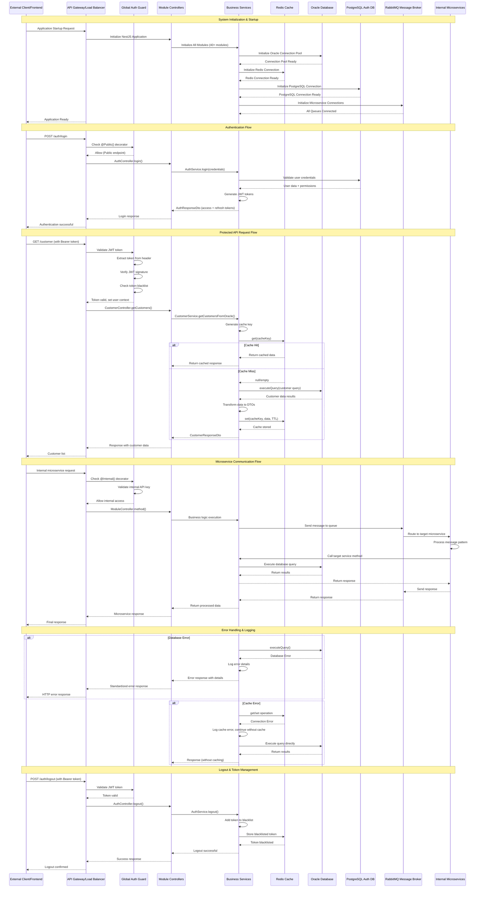

# SOFIA Service Meta - Comprehensive System Sequence Diagram

This document provides a comprehensive sequence diagram for the entire SOFIA Service Meta workspace, showing the complete system architecture, authentication flow, data access patterns, and microservice communication.

## System Overview

The SOFIA Service Meta is a comprehensive NestJS-based microservice system that provides metadata services for a Warehouse Management System (WMS). It integrates with Oracle databases, Redis caching, PostgreSQL for authentication, and RabbitMQ for microservice communication.

## Comprehensive Sequence Diagram

## System Architecture Components

### 1. **Application Layer**
- **NestJS Framework**: Main application framework
- **40+ Modules**: Each handling specific business domains
- **Global Guards**: Authentication and authorization
- **Global Interceptors**: Response transformation and exception handling
- **Global Pipes**: Request validation and transformation

### 2. **Authentication & Authorization**
- **JWT-based Authentication**: Access and refresh token system
- **Multi-application Support**: Users can access multiple applications
- **Role-based Access Control**: Different permission levels
- **Token Blacklisting**: Secure logout functionality
- **Public/Internal Endpoints**: Flexible access control

### 3. **Data Layer**
- **Oracle Database**: Primary data source for business data
- **PostgreSQL**: Authentication and user management
- **Redis Cache**: High-performance caching layer
- **Connection Pooling**: Optimized database connections

### 4. **Communication Layer**
- **REST API**: External client communication
- **RabbitMQ**: Internal microservice communication
- **Message Patterns**: Standardized microservice protocols
- **Queue Management**: Reliable message delivery

### 5. **Business Modules (40+ modules)**

#### **Core Business Modules:**
- **Customer Management**: Customer data and relationships
- **Sales Operations**: Sales orders, items, activities
- **Inventory Management**: Stock levels, transactions
- **Purchase Management**: Purchase orders, suppliers
- **Financial Management**: Invoices, receipts, payments

#### **Geographic & Organizational:**
- **Geographic Data**: Provinces, cities, districts, sub-districts
- **Organization Structure**: Branches, regions, employees
- **Warehouse Management**: Warehouse locations and operations

#### **Master Data:**
- **Item Management**: Product catalogs, UOM lists
- **Price Management**: Price lists and calculations
- **Currency & Terms**: Financial terms and currency handling

#### **Specialized Modules:**
- **DO Validation**: Delivery order validation
- **Truck Utilization**: Transportation management
- **FPPR Management**: Sales performance tracking
- **Week Sales**: Sales analytics and reporting

### 6. **Caching Strategy**
- **Cache-First Approach**: Always check cache before database
- **TTL Management**: Configurable cache expiration
- **Cache Invalidation**: Smart cache management
- **Graceful Degradation**: System continues without cache

### 7. **Error Handling & Monitoring**
- **Global Exception Filter**: Centralized error handling
- **Response Interceptor**: Standardized response format
- **Comprehensive Logging**: Detailed operation tracking
- **Health Checks**: System monitoring and diagnostics

### 8. **Security Features**
- **Helmet Security**: HTTP security headers
- **CORS Configuration**: Cross-origin request handling
- **Input Validation**: Request data validation
- **SQL Injection Prevention**: Parameterized queries

## Key Design Patterns

### 1. **Repository Pattern**
- Services abstract database operations
- Consistent data access across modules
- Easy testing and maintenance

### 2. **CQRS (Command Query Responsibility Segregation)**
- Separate read and write operations
- Optimized for different access patterns
- Better performance and scalability

### 3. **Microservice Architecture**
- Loosely coupled services
- Independent deployment
- Scalable and maintainable

### 4. **Event-Driven Communication**
- Asynchronous message processing
- Decoupled service communication
- Reliable message delivery

## Performance Optimizations

1. **Database Connection Pooling**: Efficient resource utilization
2. **Redis Caching**: Reduced database load
3. **Query Optimization**: Efficient Oracle queries
4. **Pagination Support**: Large dataset handling
5. **Connection Retry Logic**: Resilient connections
6. **Graceful Degradation**: System reliability

## Monitoring & Observability

- **Structured Logging**: Comprehensive operation tracking
- **Health Checks**: System status monitoring
- **Performance Metrics**: Response time tracking
- **Error Tracking**: Detailed error information
- **Audit Trails**: User action tracking

This comprehensive system provides a robust, scalable, and maintainable foundation for warehouse management operations, with strong emphasis on performance, security, and reliability.
